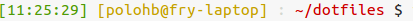

# polohb dotfiles

## Dotfiles

Dotfiles are used to customize the system. Those are mine for linux.

## Install
Run this : 
```
cd ~/
git clone https://github.com/polohb/dotfiles.git
cd dotfiles
bash makesymlinks.sh 
```

What the script do :
 
 * backup `~/.dotfiles` to `.~/dotfiles_old/` 
 * symlinks files from `~/dotfiles/home/` to the home directory `~/`


## Hierarchy
<!-- generated with tree -->
```
├── home
│   ├── bash_alias
│   ├── bash_logout
│   ├── bash_prompt
│   ├── bashrc
│   ├── profile
│   ├── screenrc
│   └── vimrc
├── makesymlinks.sh
└── README.md
```

### What's in it : 

#### bash_aliases :

* ls :
 * `ll` for ='ls -lh'
 * `la` for 'ls -A'
 * `l` for 'ls -CF'
 * `lla` for 'll -Al'

* tar : 
 * `tarc` for 'tar -cvvzf'
 * `tarx` for 'tar -xvvzf'
 * `tart` for 'tar -tvvzf

* git (only if `/usr/bin/git` exist) : 
 * `gco` for 'git checkout'
 * `gc`for 'git commit'
 * `g+` for 'git add'
 * `gpush` for 'git push'
 * `gpom` for 'git push origin master'
 * `gpull` for 'git pull'
 * `gs` for 'git status'
 * `gb` for 'git branch'
 * `gl` for 'git log'
 * `gdiff` for 'git diff'

and others minors alias (@see ~/dotfiles/home/bash_alias)


#### bash_prompt :

 * Define some color for a more simple PS1 def.
 * Prompt will be like this : 
 
 


#### profile : 

 * Enable `~/.bashrc` if running bash.
 * If `~/bin/` exist then add it PATH.


#### screenrc : 

 * Customize screen with somegeneral option
 * Add some keybindings for a more simple navigation :
  * `F1` select window 0
  * `F2` select window 1
  * `F3` select window 2
  * `F4` select window 3
  * `F5` go to previous window
  * `F6` go to next window
  * `F7` change the title
  * `F8` create a new window 
  * `F9` kill the current window


#### vimrc :

Todo : update vimrc description.

 
